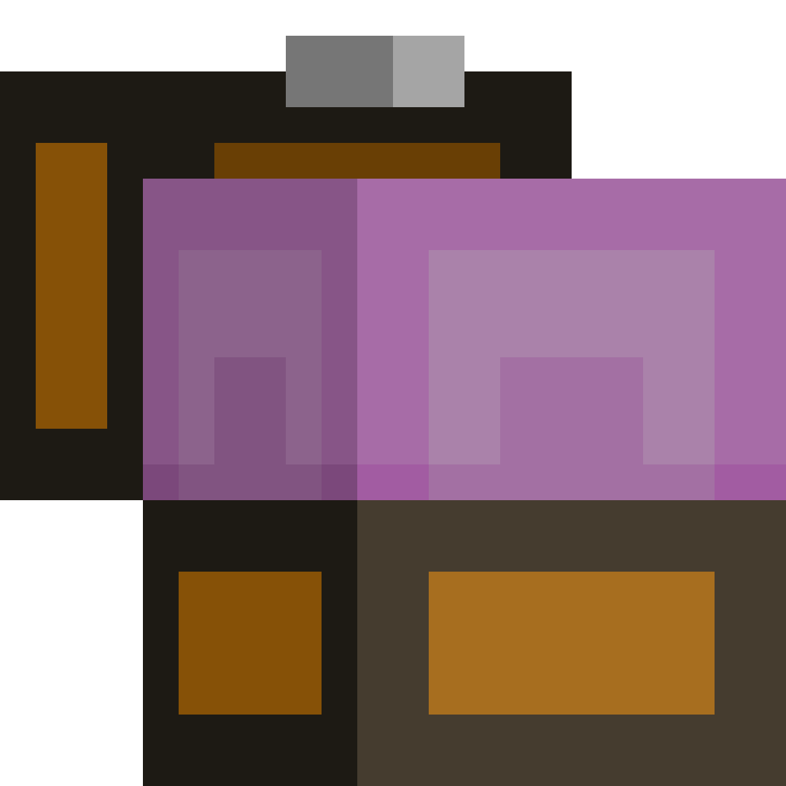
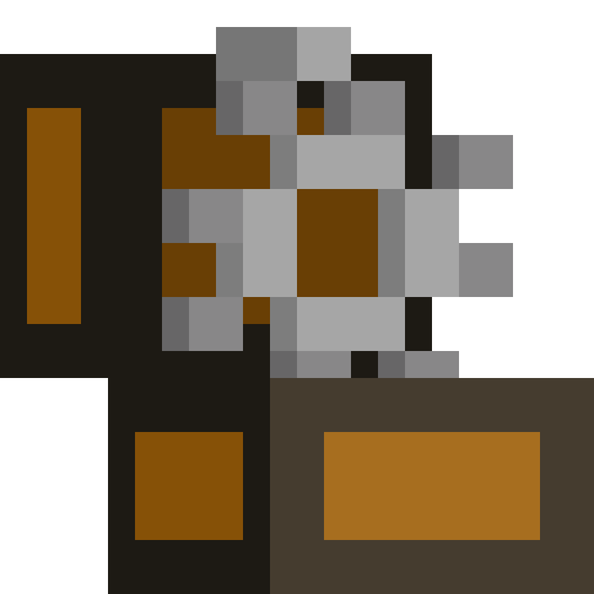
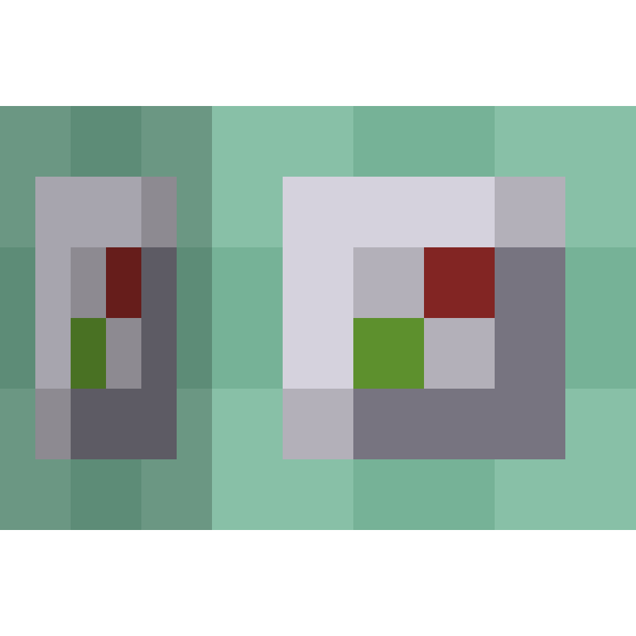
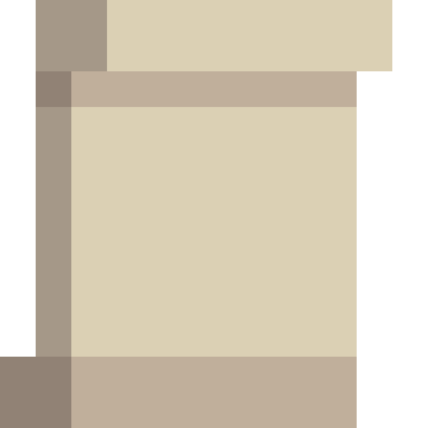
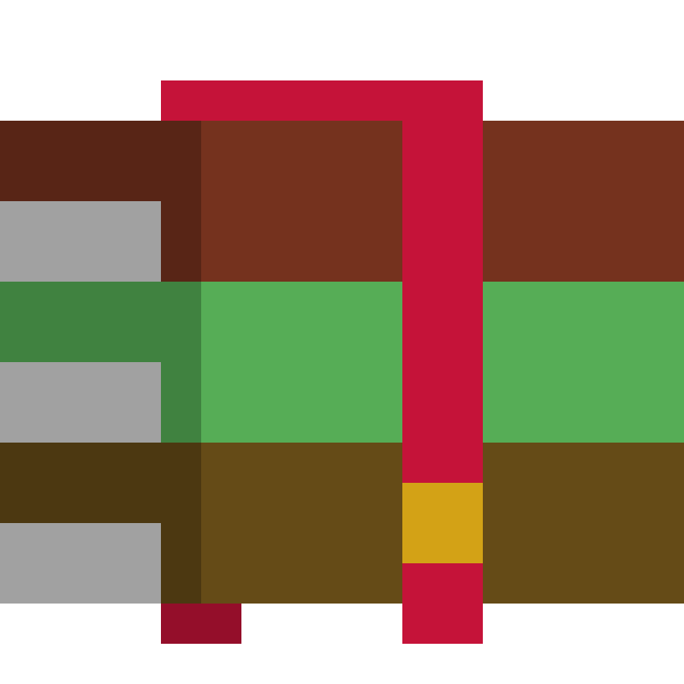

<p align="center">
  
  
  
  
</p>

<p align="center">
  <b>A dedicated server-side Fabric mod for managing, serving server resource packs, and automatically syncing resource packs and world datapacks from GitHub repositories.</b>
</p>

---

##  Table of Contents

- [Installation](#installation)
- [How to Set Up & Configure](#how-to-set-up--configure)
- [Commands](#commands)
- [Configuration Reference](#configuration-reference)
- [GitHub Repository Sync](#github-repository-sync)
- [Custom Messages](#custom-messages)
- [Credits](#credits)
- [License](#license)

---

##  Installation

1. Download `resourceloader-0.8.jar` or compile it with `.\gradlew.bat build`.
2. Place the `.jar` file into your server's `mods/` directory.
3. Start your server once to generate the default configuration files.
4. Customize `config/resourceloader/config.json` to suit your server's needs.

> **Note:** ResourceLoader is 100% server-side. Players joining your server do not need to install any client-side mod.

---

##  How to Set Up & Configure

### 1. Setting Up Resource Packs
- **Local Packs**: Place your `.zip` resource packs into `config/resourceloader/packs/`. Set `serverPack` to the file name (e.g., `"main_pack.zip"`) to send it to players on join.
- **Pack Aliases**: Add named packs to `resourcePacks` so players can switch using `/load <pack_name>`.
- **External URLs**: You can also point pack entries to direct download URLs (e.g., `"https://example.com/pack.zip"`).

### 2. Setting Up GitHub Datapack Sync
Sync datapacks directly from GitHub into your active Minecraft world:
- Set `datapacks.enabled` to `true`.
- Add an entry under `datapacks.githubDatapacks` with the repository (`Owner/Repo` or full URL).
- If your datapack is inside a subfolder (e.g. `datapack` or `data`), specify it in `path`.
- If `datapacks.autoReloadOnUpdate` is `true`, the server will automatically trigger a `/reload` when a new commit is detected.
- Leave `datapacks.customWorldDirectory` empty to automatically target your server's active world directory (`world/datapacks/`).

### 3. Setting Up Built-in HTTP Server
ResourceLoader hosts your resource packs so players can download them directly from your server without third-party file hosts:
- **Port**: Default is `40021`. Make sure this TCP port is open/forwarded on your router or firewall.
- **Address**: Leave empty to auto-detect your external IP, or enter your public server IP / domain name (e.g., `"play.example.com"`).

---

##  Commands

| Command | Aliases | Description |
| :--- | :--- | :--- |
| `/load [pack]` | `/resourceload` | Load the server resource pack or a specific pack. |
| `/load <pack> <targets>` | - | Send a resource pack to specific player(s) (Admin). |
| `/unload [pack]` | `/resourceunload` | Unload active server resource packs from your client. |
| `/packlist` | `/listpacks`, `/resourcepacks` | List available packs with clickable load buttons. |
| `/autoload <pack\|clear>` | - | Set or clear your preferred pack to load automatically on join. |
| `/syncgithub [pack]` | `/githubsync`, `/rsync` | Check & download updates from configured GitHub repos (Admin). |
| `/syncdatapack [name]` | `/datapacksync`, `/dsync` | Pull and update datapacks from GitHub repositories into your world (Admin). |
| `/mergepack <output> <p1> <p2>...` | `/merge` | Merge two or more packs into a new pack (Admin). |
| `/checkpack <pack>` | `/validatepack` | Validate a resource pack structure (Admin). |
| `/resourcereload` | `/rreload` | Reload configuration, messages, and packs (Admin). |
| `/clearcache` | `/cacheclear` | Clear downloaded pack and hash caches (Admin). |
| `/resourceversion` | `/rversion` | Show mod version information (Admin). |
| `/resourcehelp` | `/rhelp` | Display command help in chat. |

---

##  Configuration Reference

File location: `config/resourceloader/config.json`

```json
{
  "serverPack": "main_pack.zip",
  "resourcePacks": {
    "pvp": "pvp.zip",
    "remote": "https://example.com/pack.zip"
  },
  "githubPacks": {
    "dev_pack": {
      "repo": "your-username/your-resource-pack",
      "branch": "main",
      "path": "resourcepack",
      "autoUpdate": true,
      "checkIntervalMinutes": 10,
      "token": ""
    }
  },
  "datapacks": {
    "enabled": true,
    "customWorldDirectory": "",
    "autoReloadOnUpdate": true,
    "githubDatapacks": {
      "dev_datapack": {
        "repo": "your-username/your-datapack",
        "branch": "main",
        "path": "datapack",
        "autoUpdate": true,
        "checkIntervalMinutes": 10,
        "token": ""
      }
    }
  },
  "storage": {
    "resourcePackDirectory": "",
    "autoDetection": true
  },
  "server": {
    "port": 40021,
    "address": "",
    "localhost": false,
    "useHttps": false
  },
  "compression": {
    "enabled": true,
    "autoSelect": true,
    "defaultLevel": "medium"
  },
  "enforcement": {
    "enabled": false,
    "required": false,
    "prompt": "Please accept the server resource pack.",
    "kickOnDecline": true,
    "kickOnFail": true
  },
  "messages": {
    "enabled": true,
    "showLoadingMessages": true,
    "showSuccessMessages": true,
    "showErrorMessages": true,
    "prefix": "&7[&eResourceLoader&7] &r"
  }
}
```

### Settings Overview

| Setting | Type | Description |
| :--- | :--- | :--- |
| `serverPack` | String | Default pack file or URL sent to joining players. |
| `resourcePacks` | Map | Named aliases mapped to local `.zip` files or download URLs. |
| `githubPacks` | Map | Direct GitHub repository sources for live resource pack development. |
| `datapacks.enabled` | Boolean | Master toggle for GitHub datapack sync features. |
| `datapacks.customWorldDirectory` | String | Custom world path (leave blank to auto-target active server world). |
| `datapacks.autoReloadOnUpdate` | Boolean | Automatically trigger server reload (`/reload`) when a datapack updates. |
| `datapacks.githubDatapacks` | Map | Direct GitHub repository sources for live datapack development. |
| `server.port` | Integer | TCP port for the built-in HTTP server (Default: `40021`). |
| `server.address` | String | Public IP or domain name for pack downloads (leave empty for auto-detection). |
| `server.localhost` | Boolean | Restrict HTTP server to localhost only (useful behind reverse proxies). |
| `compression.enabled` | Boolean | Automatically optimize pack compression for faster downloads. |
| `enforcement.enabled` | Boolean | Require players to accept the pack to stay on the server. |
| `messages.enabled` | Boolean | Master toggle for all chat messages. |
| `messages.prefix` | String | Custom chat prefix for mod messages. |

---

##  GitHub Repository Sync

Develop your texture packs and datapacks directly in GitHub repositories and have the server automatically pull changes.

| Option | Type | Description |
| :--- | :--- | :--- |
| `repo` | String | GitHub repository in `Owner/Repo` format or full HTTPS URL. |
| `branch` | String | Git branch to track (e.g. `main` or `master`). |
| `path` | String | Subfolder containing `pack.mcmeta` and `assets/` or `data/` (leave empty if at repo root). |
| `autoUpdate` | Boolean | Automatically poll GitHub for new commits periodically. |
| `checkIntervalMinutes` | Integer | Interval in minutes between background update checks. |
| `token` | String | Optional Personal Access Token for private repositories or rate limits. |

---

##  Custom Messages

You can customize messages directly in `config/resourceloader/messages.json` or by adding `messages.customMessages` in `config.json`. Standard color codes (`&a`, `&c`, `&e`, etc.) are supported.

| Message Key | Default Text |
| :--- | :--- |
| `prefix` | `&7[&eResourceLoader&7] &r` |
| `general.reload-success` | `&aConfiguration and textures reloaded successfully!` |
| `general.invalid-pack` | `&cResource pack '%pack%' not found!` |
| `resource-packs.loading` | `&eLoading resource pack %pack%...` |
| `resource-packs.load-success` | `&aResource pack loaded successfully!` |
| `resource-packs.load-failed` | `&cFailed to load resource pack: %error%` |
| `resource-packs.unloaded` | `&aResource pack has been unloaded.` |
| `autoload.set` | `&aSet &6%pack% &aas your preferred resource pack.` |
| `enforcement.declined` | `&cYou must accept the resource pack to play on this server!` |

---

##  Credits

- **Datapack Icons**: Visual icon assets sourced from the [FuncFusion/mc-dp-icons](https://github.com/FuncFusion/mc-dp-icons) suite.

---

##  License

Copyright (c) 2026 RedDev. **All Rights Reserved.**

See the [LICENSE](LICENSE) file for details.
